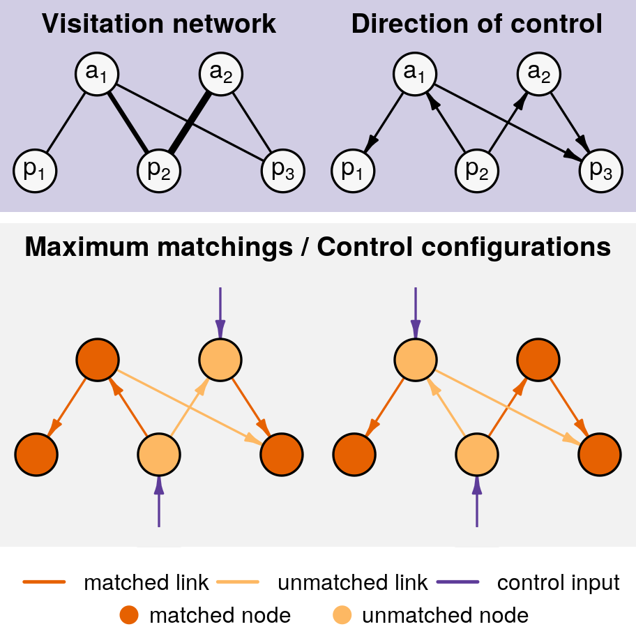

# Keystoness, centrality and the structural controllability of pollination networks

*__Fernando Cagua__, Kate Wooton, and Daniel Stouffer*

We apply structural controllability to pollination networks and are able to identify a set of species that are critical to changing the state of the community and underpin the stable coexistence of species in their communities. 

 

  

 

This project has been published as a peer-reviewed article at the **Journal of Ecology**. 
Please cite as "Cagua EF, Wootton KL, Stouffer DB. Keystoneness, centrality, and the structural controllability of ecological networks. J Ecol. 2019. doi: *[10.1111/1365-2745.13147](https://doi.org/10.1111/1365-2745.13147)*."

You can download a copy of the paper from the publisher page (paywalled) or, alternatively, download the [latest non-copyedited version of the paper from this repo](https://github.com/stoufferlab/driver-species/releases/latest).

## Summary

1. An important dimension of a species' role is its ability to alter the state and maintain the diversity of its community. 
Centrality metrics have often been used to identify these species, which are sometimes referred to as "keystone" species. 
However, the relationship between centrality and keystoneness is largely phenomenological and based mostly on our intuition regarding what constitutes an important species. 
While centrality is useful when predicting which species' extinctions could cause the largest change in a community, it says little about how these species could be used to attain or preserve a particular community state.

2. Here we introduce structural controllability, an approach that allows us to quantify the extent to which network topology can be harnessed to achieve a desired state. 
It also allows us to quantify a species' control capacity—its relative importance—and identify the set of species that are critical in this context because they have the largest possible control capacity. 
We illustrate the application of structural controllability with ten pairs of uninvaded and invaded plant-pollinator communities.

3. We found that the controllability of a community is not dependent on its invasion status, but on the asymmetric nature of its mutual dependences. 
While central species were also likely to have a large control capacity, centrality fails to identify species that, despite being less connected, were critical in their communities. 
Interestingly, this set of critical species was mostly composed of plants and included every invasive species in our dataset. 
We also found that species with high control capacity, and in particular critical species, contribute the most to the stable coexistence of their community.
This result was true, even when controlling for the species' degree, abundance/interaction strength, and the relative dependence of their partners. 

4. *Synthesis*: Structural controllability is strongly related to the stability of a network and measures the difficulty of managing an ecological community.
It also identifies species that are critical to sustain biodiversity and to change or maintain the state of their community and are therefore likely to be very relevant for management and conservation. 

**Keywords:** Invasive species, keystone species, management interventions, mutualism, network control theory, plant population and community dynamics, species' importance, control capacity, structural stability

## Reproduce the results

### 1. Check requirements

1. Make sure that the software and hardware requirements (below) have been met. All code was tested on an x86_64-apple-darwin15.6.0 (64-bit) platform but should run in most UNIX systems. Requirements include:

* R version 3.4.4 (2018-03-15) -- "Someone to Lean On"
* packrat: R package version 0.4.8-1.
* Multicore processor with 4 cores or more
* 8GB RAM or more

### 2. Get the code

*Option A: clonning the repo*

2. Clone or download this repository in your machine
3. If using RStudio, opening `driver-species.Rproj` should initialize *packrat* and install the necessary R packages. Otherwise you need to initialize packrat yourself by running `source("packrat/init.R")` or `packrat::restore()` while in the local direc (Revise)

*Option B: using the project bundle *

2. Download the `packrat-bundle.tar.gz` from the [latest project release](https://github.com/stoufferlab/driver-species/releases/latest).
3. Unbundle the project using `packrat::unbundle(bundle, where, ..., restore = TRUE)`

### 3. Run analyses

4. Run `make` from the main directory in your bash terminal. 
5. Now wait... it takes a couple of hours to perform all analysis. It's OK to interrupt the process though, I use [`drake`](https://github.com/ropensci/drake) to manage the data analysis workflow. This means, that next time you attempt to build the results (using `make`) it will continue where it was left. 
