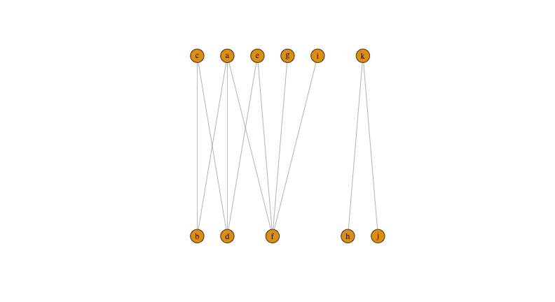
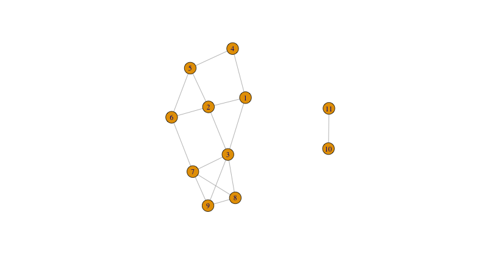
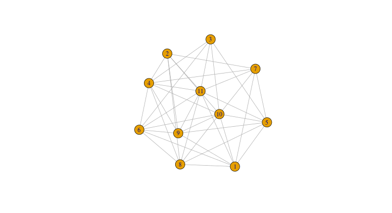
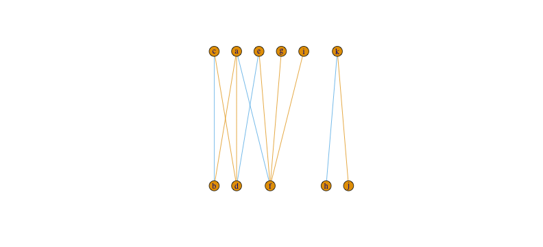
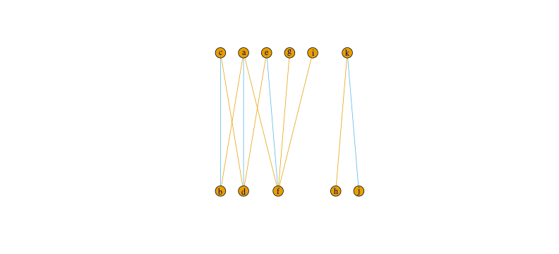
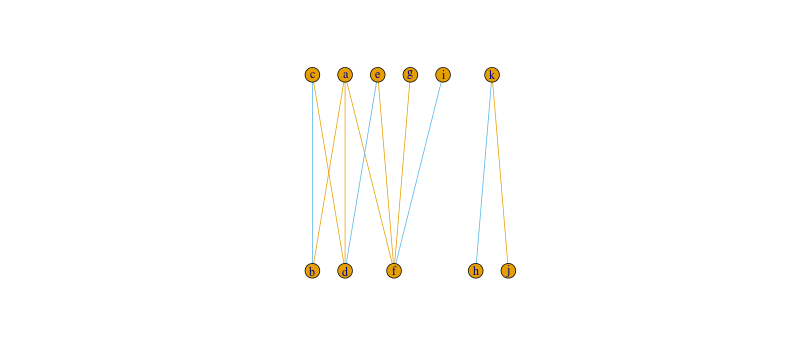
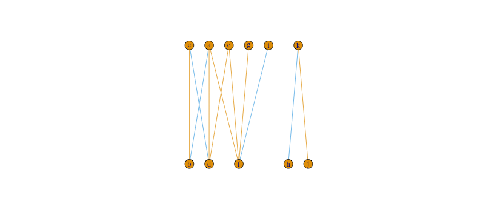
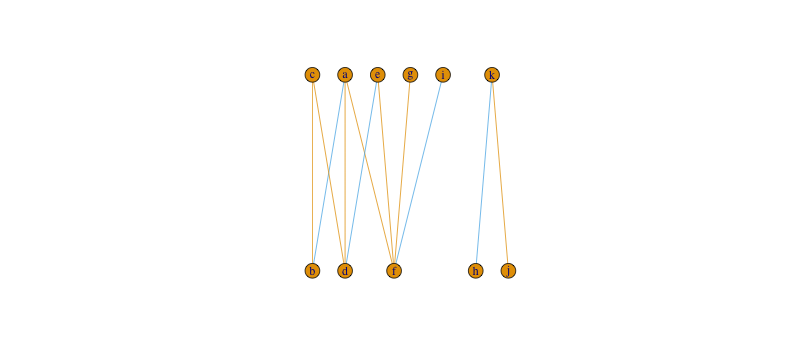
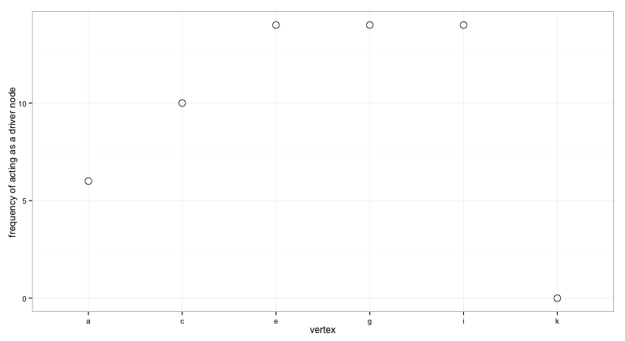

Here I show how to calculate the bipartite maximum matchings of an arbitrary bipartite graph.

### 1. Create the graph


```r
g <- graph_from_literal( a-b-c-d-e-f-a, a-d, g-f, h, i-f, j-k-h)
V(g)$type <- c(FALSE,TRUE)
g %>%	add_layout_(as_bipartite()) %>%	plot()
```



### 2. Calculate a maximum bipartite matching


```r
match <- max_bipartite_match(g) 
print(match)
```

```
## $matching_size
## [1] 4
## 
## $matching_weight
## [1] 4
## 
## $matching
##   a   b   c   d   e   f   g   h   i   j   k 
## "b" "a" "d" "c" "f" "e"  NA "k"  NA  NA "h"
```

This give use the size of the matching, this is how many nodes can be matched on each side. 

### 3. Make the line graph of the bipartite network

Which is the an alternative representation in which edges become nodes and there is a link between them if they share a node in the original network


```r
h <- g %>% igraph::make_line_graph() %T>% plot
```



### 4. Get the complementer graph of the line graph

Which is equivalent of changing all 0s for 1s and all 1s for 0s in the adjacency matrix


```r
h <- h %>% igraph::complementer() %T>% plot
```



### 5. Find all the cliques that have the same size as the maximum matching found before


```r
cli <- h %>% igraph::max_cliques(min = match$matching_size)
cli <- unlist(cli) %>% matrix(ncol = match$matching_size, byrow = TRUE)
print(cli)
```

```
##       [,1] [,2] [,3] [,4]
##  [1,]    3    4    6   10
##  [2,]    3    4    6   11
##  [3,]    2    4   10    7
##  [4,]    2    4   10    8
##  [5,]    2    4   10    9
##  [6,]    2    4   11    7
##  [7,]    2    4   11    8
##  [8,]    2    4   11    9
##  [9,]    4    6   10    8
## [10,]    4    6   10    9
## [11,]    4    6   11    8
## [12,]    4    6   11    9
## [13,]    5    1   10    7
## [14,]    5    1   10    8
## [15,]    5    1   10    9
## [16,]    5    1   11    7
## [17,]    5    1   11    8
## [18,]    5    1   11    9
## [19,]    6    1   10    8
## [20,]    6    1   10    9
## [21,]    6    1   11    8
## [22,]    6    1   11    9
```

### 6. Let's have a look!!!

At five of them...


```r
matchings <- apply(cli, 1, function(x) {
	y <- rep(1, length(E(g)))
	y[x] <- 2
	y
})

plyr::a_ply(matchings[, round(seq(1,20, length.out = 5))], 2, function(x){
	p <- g %>%	add_layout_(as_bipartite()) %>%	plot.igraph(edge.color = x)
})
```



### 7. Let's see the proportion of unmatched 

On posibility is to rank nodes by how many times they act as driver nodes in all maximum matchings in the network. Here we assume that we only want to match the nodes on "top"


```r
get_matched_vertex(g, choosen_type = FALSE, 
									 matchings = cli, output = "data.frame") %>%
	dplyr::filter(matched == FALSE) %>%
	ggplot() +
	geom_histogram(aes(x = v)) +
	xlab("vertex") +
	ylab("frequency of acting as a driver node") +
	theme_minimal()
```




