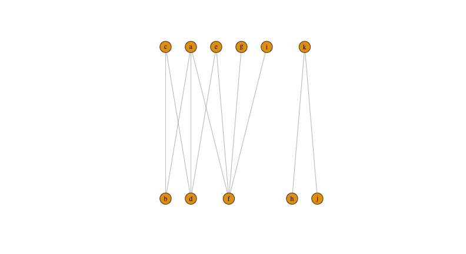
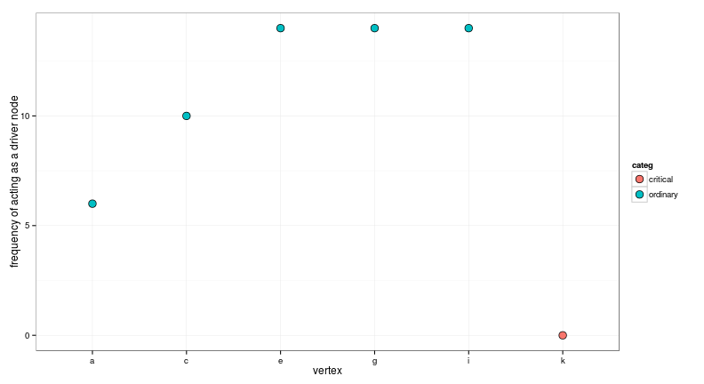

I'm interested in investingating the relative importance of different nodes (and edges) for the controlability of bipartite networks. 

# 1. All maximum matchings

One option is to see how many times the node is selected as a driver node based on all the possible maximum matchings on a bipartite network

## Find them first

Here I show how to calculate the bipartite maximum matchings of an arbitrary bipartite graph.

### Create the graph


```r
g <- graph_from_literal( a-b-c-d-e-f-a, a-d, g-f, h, i-f, j-k-h)
V(g)$type <- c(FALSE,TRUE)
g %>%	add_layout_(as_bipartite()) %>%	plot()
```


### Calculate a maximum bipartite matching


```r
match <- max_bipartite_match(g) 
print(match)
```

```
## $matching_size
## [1] 4
## 
## $matching_weight
## [1] 4
## 
## $matching
##   a   b   c   d   e   f   g   h   i   j   k 
## "b" "a" "d" "c" "f" "e"  NA "k"  NA  NA "h"
```

This give use the size of the matching, this is how many nodes can be matched on each side. 

### Make the line graph of the bipartite network

Which is the an alternative representation in which edges become nodes and there is a link between them if they share a node in the original network


```r
h <- g %>% igraph::make_line_graph() %T>% plot
```


### Get the complementer graph of the line graph

Which is equivalent of changing all 0s for 1s and all 1s for 0s in the adjacency matrix


```r
h <- h %>% igraph::complementer() %T>% plot
```


### Find all the cliques that have the same size as the maximum matching found before


```r
cli <- h %>% igraph::max_cliques(min = match$matching_size)
cli <- unlist(cli) %>% matrix(ncol = match$matching_size, byrow = TRUE)
print(cli)
```

```
##       [,1] [,2] [,3] [,4]
##  [1,]    3    4    6   10
##  [2,]    3    4    6   11
##  [3,]    2    4   10    7
##  [4,]    2    4   10    8
##  [5,]    2    4   10    9
##  [6,]    2    4   11    7
##  [7,]    2    4   11    8
##  [8,]    2    4   11    9
##  [9,]    4    6   10    8
## [10,]    4    6   10    9
## [11,]    4    6   11    8
## [12,]    4    6   11    9
## [13,]    5    1   10    7
## [14,]    5    1   10    8
## [15,]    5    1   10    9
## [16,]    5    1   11    7
## [17,]    5    1   11    8
## [18,]    5    1   11    9
## [19,]    6    1   10    8
## [20,]    6    1   10    9
## [21,]    6    1   11    8
## [22,]    6    1   11    9
```

Let's have a look!!!

At five of them...


```r
matchings <- apply(cli, 1, function(x) {
	y <- rep(1, length(E(g)))
	y[x] <- 2
	y
})

plyr::a_ply(matchings[, round(seq(1,20, length.out = 5))], 2, function(x){
	p <- g %>%	add_layout_(as_bipartite()) %>%	plot.igraph(edge.color = x)
})
```


## Analyse importance

On posibility is to rank nodes by how many times they act as driver nodes in all maximum matchings in the network. Here we assume that we only want to match the nodes on "top"


```r
node_relev_m <- get_matched_vertex(g, choosen_type = FALSE, 
									 matchings = cli, output = "data.frame") %>%
	dplyr::group_by(v) %>%
	dplyr::summarise(freq = sum(!matched))

node_relev_m %>%
	ggplot() +
	geom_point(aes(x = v, y = freq), shape = 21, size = 4) +
	xlab("vertex") +
	ylab("frequency of acting as a driver node") +
	theme_bw()
```


# 2. By removing links/nodes

Another alternative to determine the relative importance of each node (but also links) is to remove it and see how it affects the matching. Following Liu, Slotine and Barabasi 2011, for links we have the following definitions:

1. **Critical** if in it's absense we need to increase the number of driver nodes to maintain full control of the system
2. **Redundant** if it can be removed without affecting the current set of driver nodes
3. **Ordinary** if it's neither critical nor redundant, i.e., its removal can eliminate some control configurations, but the network can still be controlable in its absense 

for nodes we have the following definitions

1. **Critical** if in it's absense we need to increase the number of driver nodes to maintain full control of the system
2. **Redundant** if it after removal the current set of driver nodes decreasses
3. **Ordinary** if after removal the number of driver nodes is maintained

We wan't to see if these definitions (particularly for the nodes) agree with the measssures given by the maxumum matchings. 

Let's use the same dummy network as before. 


```r
g %>%	add_layout_(as_bipartite()) %>%	plot()
```



### Calculate a maximum bipartite matching


```r
match <- max_bipartite_match(g) 
this_side_nodes <- length(V(g)[type == F])
min_drivers <- this_side_nodes - match$matching_size
print(match)
```

```
## $matching_size
## [1] 4
## 
## $matching_weight
## [1] 4
## 
## $matching
##   a   b   c   d   e   f   g   h   i   j   k 
## "b" "a" "d" "c" "f" "e"  NA "k"  NA  NA "h"
```

## Importance for links


```r
plyr::ldply(E(g), function(x){
	matching_size <- g %>% delete_edges(x) %>%
		max_bipartite_match() %$%
		matching_size
	data.frame(e = x, matching_size = matching_size)
}) %>%
	dplyr::mutate(delta_drivers = this_side_nodes - matching_size - min_drivers,
								categ = categ_link(delta_drivers))
```

```
##     e matching_size delta_drivers     categ
## 1   1             4             0 redundant
## 2   2             4             0 redundant
## 3   3             4             0 redundant
## 4   4             4             0 redundant
## 5   5             4             0 redundant
## 6   6             4             0 redundant
## 7   7             4             0 redundant
## 8   8             4             0 redundant
## 9   9             4             0 redundant
## 10 10             4             0 redundant
## 11 11             4             0 redundant
```

Well this is boring. All edges are redundant

## Importance for nodes


```r
node_relev_c <- plyr::ldply(V(g), function(x){
	matching_size <- g %>% delete_vertices(x) %>%
		max_bipartite_match() %$%
		matching_size
	data.frame(v = x, matching_size = matching_size)
}) %>%
	dplyr::mutate(delta_drivers = this_side_nodes - matching_size - min_drivers,
								categ = categ_node(delta_drivers)) %T>% print
```

```
##    .id  v matching_size delta_drivers    categ
## 1    a  1             4             0 ordinary
## 2    b  2             3             1 critical
## 3    c  3             4             0 ordinary
## 4    d  4             3             1 critical
## 5    e  5             4             0 ordinary
## 6    f  6             3             1 critical
## 7    g  7             4             0 ordinary
## 8    h  8             4             0 ordinary
## 9    i  9             4             0 ordinary
## 10   j 10             4             0 ordinary
## 11   k 11             3             1 critical
```

This not as boring :) We can see that some are redundant ordinary and some are critical (there is no redundant one). 

# Compare 


```r
dplyr::inner_join(node_relev_m, node_relev_c, by = c("v" = ".id")) %>%
	ggplot() +
	geom_point(aes(x = v, y = freq, fill = categ), shape = 21, size = 4) +
	xlab("vertex") +
	ylab("frequency of acting as a driver node") +
	theme_bw()
```

```
## Warning in inner_join_impl(x, y, by$x, by$y): joining factor and character
## vector, coercing into character vector
```



Well now I realise this network was a crappy example. Obviously removing R decreasses the matching... But I don't think that'll happen using the proper bipartite matching (this is having head vertices in one side and tail vertices in the other). Especially because f, d, and b were also critical. 

Still this is a good proof of concept of what will come for the other networks
