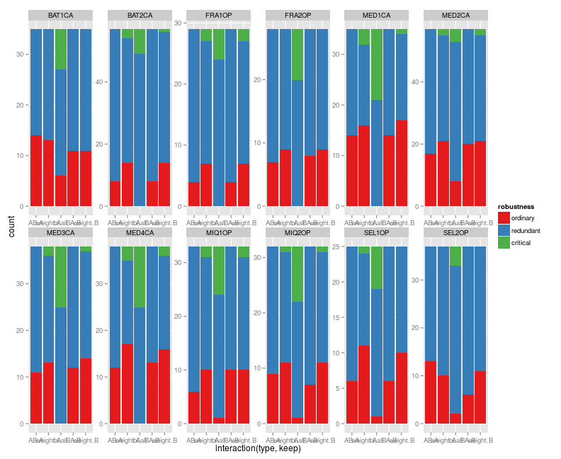
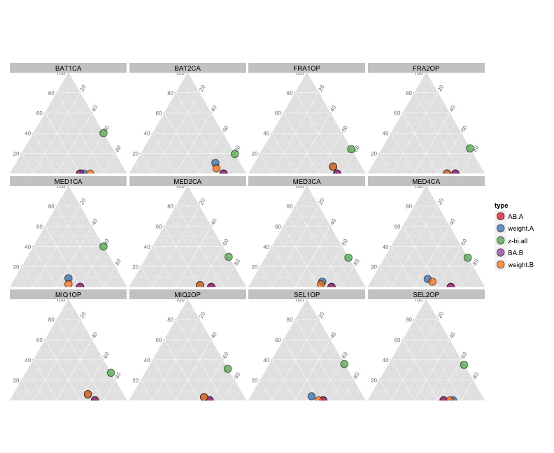

```r
# load utility functions
nn <- list.files("./code/functions", full.names = TRUE) %>% lapply(source)
# load netw
net <- list.files("./data/networks/", full.names = TRUE) %>%
	lapply(readRDS)
names(net) <- list.files("./data/networks/", full.names = FALSE) %>%
	stringr::str_split("\\.") %>% lapply(`[`, 1) %>% unlist ()
```

Let's have a look at the diferences in number of driver nodes of the different methods.


```r
# generate parameter space
space <- expand.grid(type = c("z-bi", "weight", "AB", "BA"), 
										 net = 1:length(net)) %>%
	dplyr::inner_join(data.frame(type = c("z-bi", "AB", "BA", "weight", "weight"),
															 keep = c("all", "A", "B", "A", "B")))
```

```
## Joining by: "type"
```

```r
# select the corresponding one for this computation

driver_nodes <- 1:nrow(space) %>%
	plyr::laply(function(i){
		p <- space[i,]
		n <- net[[p$net]] %>%
			keep_largest_component() %>%
			bipartite_digraph(type = p$type, keep = p$keep)
		igraph::E(n)$weight <- 1
		n %>%
			n_unmatched_vertex()
	})

space %<>%
	dplyr::mutate(n_driver = driver_nodes,
								type = interaction(type, keep))

net_names <- plyr::ldply(net, function(x){
	length(igraph::V(x))
}) %>%
	dplyr::mutate(net = 1:nrow(.)) %>%
	dplyr::rename(n_species = V1,
								net_name = `.id`)

space <- dplyr::inner_join(space, net_names) %>%
	dplyr::mutate(n_no_driver = n_species - n_driver)
```

```
## Joining by: "net"
```

```r
glm(cbind(n_driver, n_no_driver) ~ type,  data = space, family = "binomial") %>% summary
```

```
## 
## Call:
## glm(formula = cbind(n_driver, n_no_driver) ~ type, family = "binomial", 
##     data = space)
## 
## Deviance Residuals: 
##      Min        1Q    Median        3Q       Max  
## -1.60210  -0.35225   0.09048   0.25338   2.20382  
## 
## Coefficients:
##                Estimate Std. Error z value Pr(>|z|)    
## (Intercept)   1.019e+00  1.056e-01   9.648  < 2e-16 ***
## typeweight.A -3.128e-01  1.448e-01  -2.160   0.0308 *  
## typez-bi.all -1.002e+00  1.409e-01  -7.109 1.17e-12 ***
## typeBA.B     -3.414e-16  1.494e-01   0.000   1.0000    
## typeweight.B -2.732e-01  1.453e-01  -1.880   0.0601 .  
## ---
## Signif. codes:  0 '***' 0.001 '**' 0.01 '*' 0.05 '.' 0.1 ' ' 1
## 
## (Dispersion parameter for binomial family taken to be 1)
## 
##     Null deviance: 110.457  on 59  degrees of freedom
## Residual deviance:  38.798  on 55  degrees of freedom
## AIC: 284.6
## 
## Number of Fisher Scoring iterations: 4
```


This means, 

 * ~ 74% of the species for Pla-Pol or Pol-Pla 
 * ~ 67% of the species for weighted (regardless of priority)
 * ~ 50% of the species for bi-directional 

Which is quite an improvement.

# Node redundancy

Now let's have a look at the proportion of critical, redundant and ordinary nodes in each class. 


```r
folder <- "./data/redundancy/node/"

node_redundancy <- list.files(folder, full.names = TRUE) %>%
	plyr::ldply(function(x, name){
		y <- read.csv(x) 
		info <- basename(x) %>% 
			stringr::str_sub(end = -5) %>% 
			stringr::str_split("_") %>% 
			unlist()
		y %>%
			dplyr::mutate(net = info[[1]],
										type = info[2],
										keep = info[3])
	}) 

ggplot(node_redundancy) +
	geom_bar(aes(x = interaction(type, keep), fill = robustness)) +
	facet_wrap(~ net, scales = "free", nrow = 2) +
	scale_fill_brewer(palette = "Set1")
```



```r
node_redundancy %>%
	dplyr::mutate(type = interaction(type, keep)) %>%
	dplyr::group_by(net, type, robustness) %>%
	dplyr::summarise(n = n()) %>%
	tidyr::spread(robustness, n) %>%
	dplyr::mutate(critical = replace(critical, is.na(critical), 0),
								ordinary = replace(ordinary, is.na(ordinary), 0)) %>%
	ggplot(aes(x = ordinary, z = redundant, y = critical)) +
	geom_point(aes(fill = type), shape = 21, size = 5, alpha = 0.7) + 
	facet_wrap(~ net) +
	coord_tern() + 
	scale_fill_brewer(palette = "Set1")
```



In both  representations we can see that there is little variation among configurations with the same phylosophy. 

* For pla-pol or pol-pla all species are either redundant or ordinary
* There are some critical species in the weight configuration but most of them are redundant and ordinary to a lesser degree
* The bidirectional configuration makes a larger proportion of species critical species critical and almost all the other are redundant

# Save results


```r
write.csv(space, file = "./data/n_driver_species.dat", row.names = F)
write.csv(node_redundancy, file = "./data/node_redundancy.dat", row.names = F)
```

